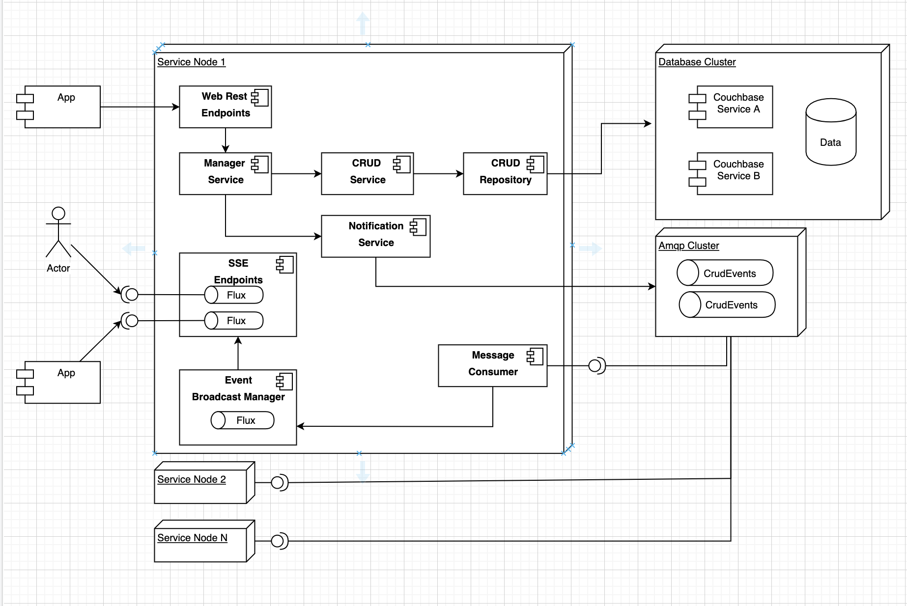

# Virtual Queue
The purpose of this PoC is to create a full reactive flow
to sent notification to clients in real time when entities have been
created, updated or deleted.

## This project includes:
- Persistence with Reactive Couchbase
- Reactive services with Spring Webflux
- Messaging with Amqp
- Realtime events with SSE
- One endpoint to test RSocket
    - You can test the endpoint with rsocket-cli like:  
        `$ rsocket-cli --route queue-stream-event tcp://localhost:7000`
        
- Architecture Diagram:
    
    
    

## How to run the project?   
1. Start Couchbase  
    `$ docker pull couchbase`  
    `$ docker run -d --name royal-couch -p 8091-8094:8091-8094 -p 11210:11210 couchbase`
2. Start RabbitMQ  
    `$ docker pull rabbitmq:3-management`  
    `$ docker run -d -p 15672:15672 -p 5672:5672 --name rcc_rabbit -e RABBITMQ_DEFAULT_USER=admin -e RABBITMQ_DEFAULT_PASS=admin rabbitmq:3-management`
3. Start the service  
    `$ mvn spring-boot:run` // This from the root of the project
    
4. Open a browser or curl console for:
    `localhost:8080/streamBoomark.html`

5. Call the rest endpoint to create a new Queue:
    ```
       curl --location --request POST 'localhost:8080/queue' \
       --header 'Content-Type: application/json' \
       --data-raw '{
           "name":"Queue A",
           "description": "Description for Queue A",
           "createdDate": "2020-07-05"
       }'
    ``` 
   
## Expected behavior
- You send CREATE_QUEUE request to the REST endpoint
- Service creates a new document in Couchbase
- Service sends a new notification to AMQP
- AMQP sends a message to the Service Consumer
- Service consumer sends the event to StreamEventEmitter
- StreamEventEmitter notifies all clients (real-time) about the changes
- Browser displays new information without any interaction or additional requests
   
### Note
All service configurations are on `${PROJECT_DIR}/vqueue/src/main/resources/application.yml`, be sure all properties are the ones configured in docker images.